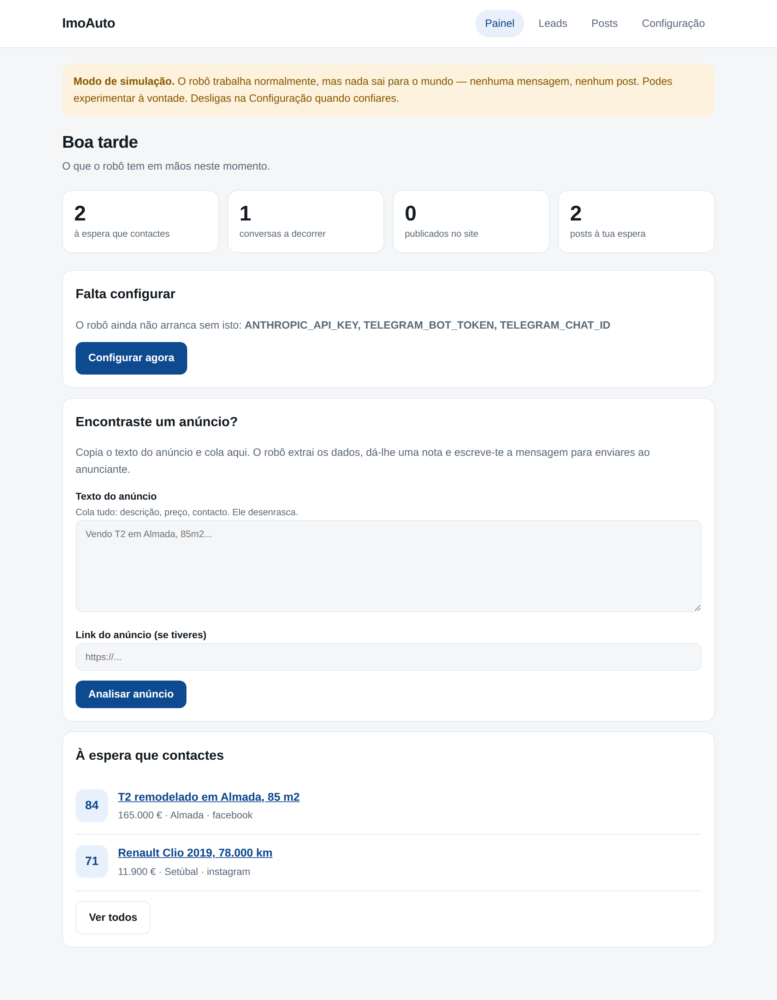
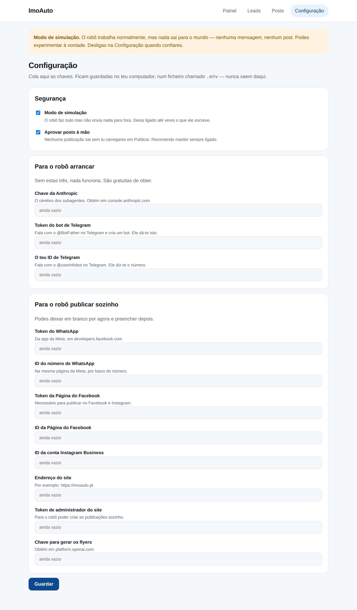
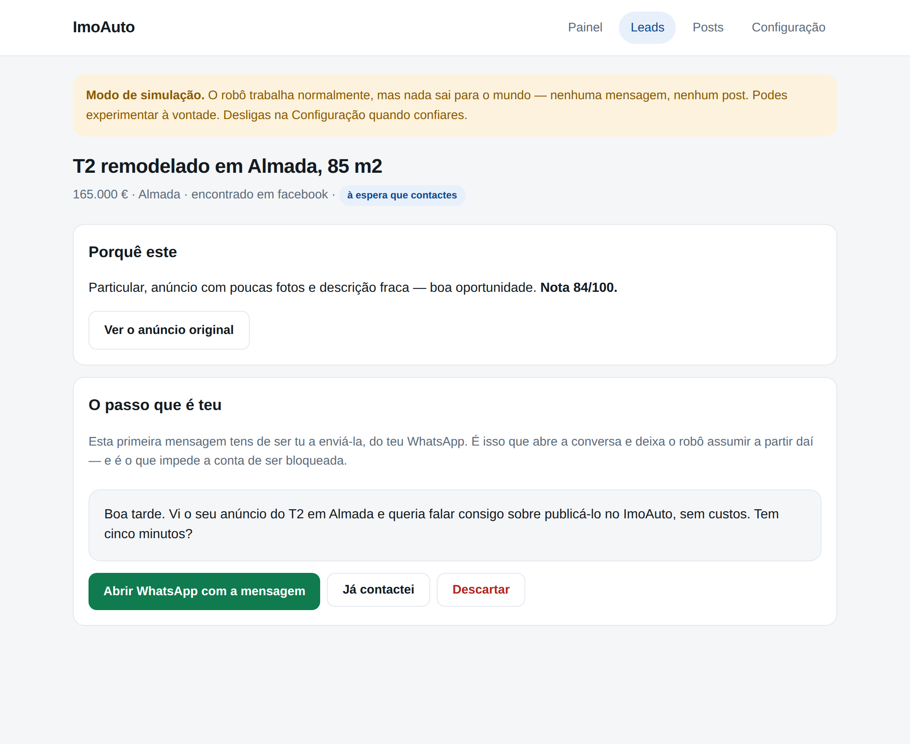
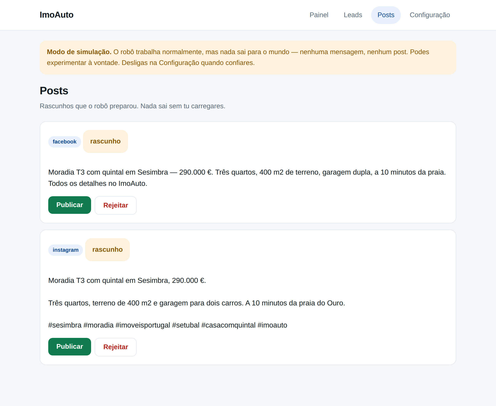

# Como usar o robô ImoAuto

Guia para quem não é da área. Não precisas de perceber de programação — só de
seguir isto uma vez.

---

## 1. Arrancar

**No Windows:** duplo clique em `ARRANCAR.bat`
**No Mac ou Linux:** duplo clique em `ARRANCAR.command`

Abre-se uma janela preta (é normal, ignora-a — não a feches) e a seguir abre-se
o painel no teu browser.

Se for a primeira vez, ele instala sozinho o que falta. Pode demorar um minuto.

---

## 2. As três chaves que ele precisa

Vai a **Configuração** no menu de cima. Precisas de colar três coisas. São
gratuitas e demoram cinco minutos a obter.

### Chave da Anthropic
É o cérebro do robô — é o que o faz pensar.
1. Vai a **console.anthropic.com** e cria conta
2. Menu **API Keys** → **Create Key**
3. Copia e cola no painel

### Bot do Telegram
1. Abre o Telegram e procura **@BotFather**
2. Escreve `/newbot` e segue o que ele pede (um nome, e um nome de utilizador
   que termine em `bot`)
3. Ele responde com um código comprido — copia e cola no painel

### O teu ID de Telegram
1. No Telegram, procura **@userinfobot**
2. Escreve `/start`
3. Ele responde com um número — copia e cola no painel

Carrega **Guardar**. Fecha o programa e volta a abrir. Está pronto.

As outras chaves (Facebook, Instagram, WhatsApp, site) podes deixar em branco
para já. O robô trabalha sem elas — só não publica sozinho.

---

## 3. O modo de simulação

Repara na barra amarela no topo do painel. Quer dizer que o robô faz tudo —
pensa, escreve, prepara os posts — **mas não envia nada para fora**.

Deixa assim uns dias. Cola anúncios, lê o que ele escreve, vê se gostas do tom.
Quando confiares, vais a Configuração e desligas a caixinha do modo de simulação.

Há uma segunda tranca por baixo: **Aprovar posts à mão**. Essa recomendo deixar
sempre ligada — nenhuma publicação sai sem tu carregares no botão.

---

## 4. O dia-a-dia

### Encontraste um anúncio no Facebook ou Instagram?
Copia o texto todo (descrição, preço, contacto) e cola no painel, na caixa
**Encontraste um anúncio?**. Carrega em **Analisar anúncio**.

Em poucos segundos o robô diz-te:
- os dados organizados (preço, zona, tipologia, telefone)
- uma nota de 0 a 100 — quanto vale a pena ir atrás
- **a mensagem já escrita** para enviares à pessoa

### Enviar a primeira mensagem
Na ficha do lead, carrega em **Abrir WhatsApp com a mensagem**. Abre o WhatsApp
com o texto já lá dentro. Lês, mudas o que quiseres, envias.

**Esta parte tem de ser mesmo tu.** Não é preguiça do robô: é a regra que
impede a conta do ImoAuto de ser bloqueada. O robô nunca escreve primeiro a
um desconhecido.

### A partir daí, é com ele
Quando a pessoa responder, o robô assume sozinho: explica o ImoAuto, faz as
perguntas, pede as fotos, descarrega-as, cria a publicação no site, gera o
flyer e prepara os posts.

Tu vês tudo no painel. Se ele não souber responder alguma coisa, avisa-te.

### Aprovar os posts
Vai a **Posts**. Vês o flyer e o texto que ele escreveu para cada rede.
**Publicar** ou **Rejeitar**. Só isso.

---

## 5. Também dá pelo telemóvel

Depois de configurares o Telegram, o robô fala contigo por lá. Recebes os leads
no telemóvel com os mesmos botões — Abrir WhatsApp, Já contactei, Descartar.

É o mesmo robô: o que fizeres no telemóvel aparece no painel e vice-versa.

---

## Perguntas que costumam surgir

**Tenho de deixar o computador ligado?**
Sim, enquanto quiseres que ele trabalhe. Se preferires que trabalhe sozinho
24 horas, isso põe-se num servidor — diz e trata-se disso.

**Ele pode publicar sem eu ver?**
Não, enquanto a caixa "Aprovar posts à mão" estiver ligada. E está por
predefinição.

**Onde ficam as minhas chaves?**
Num ficheiro chamado `.env`, no teu computador. Nunca saem daí.

**Ele apaga alguma coisa do meu site?**
Não. Só cria publicações novas.

**Enganei-me a configurar.**
Volta a Configuração, corrige e guarda outra vez. Não parte nada.

**A janela preta fechou-se e o painel deixou de funcionar.**
Normal — a janela preta é o programa. Abre outra vez pelo `ARRANCAR`.
